# Week 01

## 학습 기간
2026-09-02 ~ 2026-09-07

## 과제 내용
### 1-1 자기소개 출력   
Hello.java 를 만들어 이름·학번·학과를 세 줄로 출력하세요.

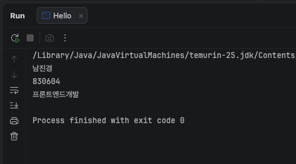

### 1-2 별 삼각형 println 만 써서 아래 모양을 출력하세요. (반복문 금지)   
    *    
    **    
    *** 
    **** 
    *****

#### 실행 결과   
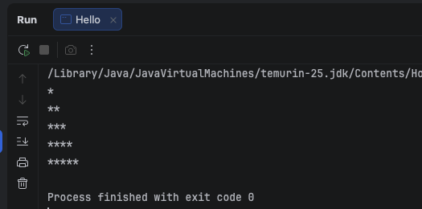

### 1-3. 대소문자 오류 확인   
println 을 Println 으로 바꿔 실행하고, 오류 메시지 맨 아랫줄을 그대로 적으세요.   
몇 번째 줄이라고 나오나요?

#### 실행 결과
```
java: cannot find symbol
symbol:   method printIn(java.lang.String)
location: variable out of type java.io.PrintStream
```
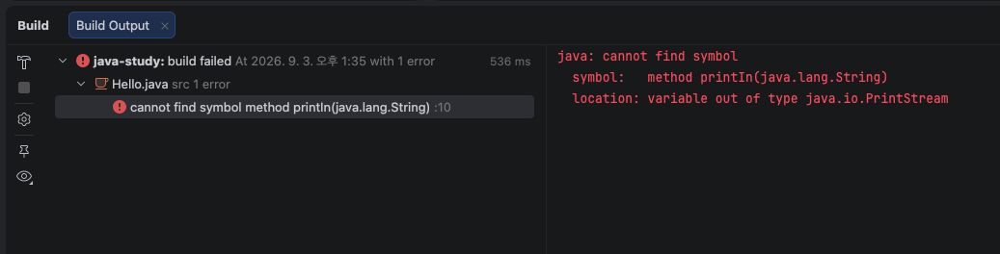

### 1-4. 세미콜론 오류 확인 
세미콜론을 하나 지우고 실행해 오류 메시지를 적으세요.   
몇 번째 줄이라고 나오나요? 

#### 실행 결과
```
java: ';' expected
```
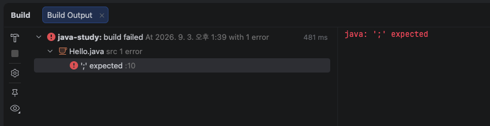

###  1-5. 파일명 불일치 
파일 이름과 클래스 이름을 다르게 만들어 보고 무슨 일이 생기는지 적으세요.

#### 실행 결과
맨 첫줄에 빨간줄이 생기고 오류 메시지 노출 

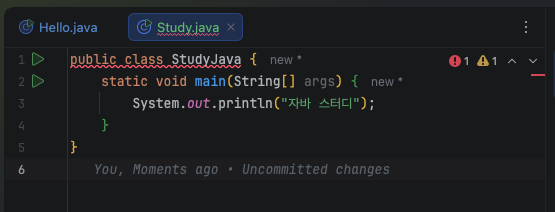
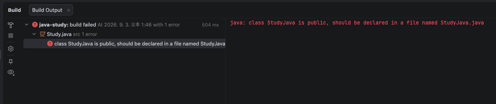

## 도전 과제
### 도전 1. 이스케이프 문자
\n, \t, \", \\ 를 각각 써서 결과를 확인하세요.   

#### 실행 결과
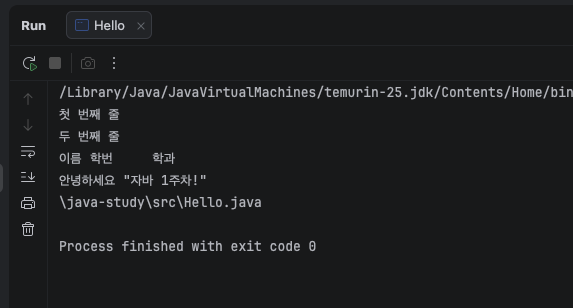

### 도전 2. printf 맛보기   
System.out.printf("이름 %s, 나이 %d%n", "홍길동", 20); 를 실행해 보세요.   

#### 실행 결과
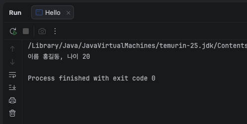

### 도전 3. 명함 출력 
println 만으로 아래 같은 명함 틀을 출력하세요.   
```
    +--------------------+ 
    |      홍 길 동        | 
    |   010-1234-5678     | 
    +--------------------+
```
#### 실행 결과
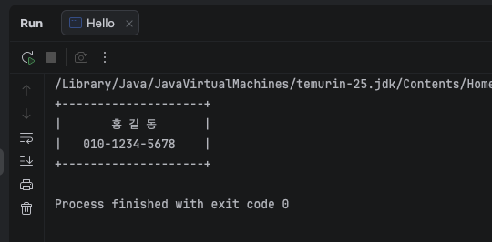

## 제출 전 확인
- [x] 파일명과 클래스명이 같은가
- [x] 모든 문장 끝에 세미콜론이 있는가
- [x] 따옴표가 영문 " " 인가
- [x] 한글이 안 깨지는가
- [x] 오류 메시지 3개를 적었는가

## 질문
### 질문 1.
설치가이드 8. 첫 자바 프로그램 (설치 확인용)   
javac Hello.java —> 메시지 안나옴   
java Hello —> 실행됨   
JDK 재설치 했고 터미널도 재실행 했음  

#### 실행 결과
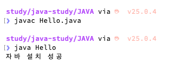

### 질문 2.
IntelliJ에서 아래와 같이 동작함   
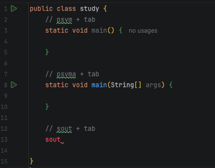