# Week 02
***
## 학습 기간
2026-09-07 ~ 2026-09-14
***
## 과제 내용
### 2-1. 자료형 5개
아래 다섯 개를 각각 알맞은 자료형으로 선언하고 출력하세요.   
힌트: 다섯 개가 전부 다른 자료형입니다.
```
이름      남진경
나이      20
키        174.5
학점      A
재학여부   true
```
#### - 실행 결과
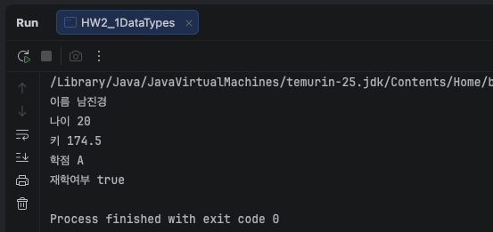
***

### 2-2. int 의 한계
int 변수에 21억보다 큰 수를 넣고 실행하세요.   
오류 메시지를 그대로 적고, 어떻게 고쳤는지 쓰세요.

#### - 실행 결과
int value = 2200000000 을 지정 하였고 아래와 같이 오류가 발생  
long value = 2200000000L; 로 수정하여 오류 해결

```
java: integer number too large (HW2_2IntOverflow.java:6)
```

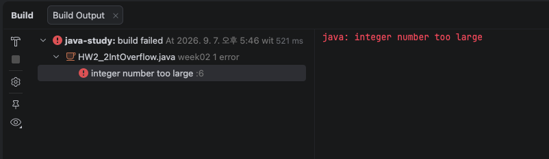

```
int    -2,147,483,648  ~  2,147,483,647     약 ± 21억   
long   훨씬 크다                              약 ± 922경
```
- 돈이나 개수를 다룰 때는 처음부터 long 사용
***

### 2-3. char 에 두 글자
char 변수에 글자 두 개를 넣어 보고 오류 메시지를 적으세요.   
char 와 String 이 뭐가 다른지 한 줄로 정리하세요.
#### - 오류 메시지
```
java: unclosed character literal (HW2_3CharVsString.java:6)
java: unclosed character literal (HW2_3CharVsString.java:6)
java: not a statement (HW2_3CharVsString.java:6)
```
char는 ' ' 안에 한 글자만을 담고 String은 " " 안에 여러 문자를 담음

#### - 실행 결과
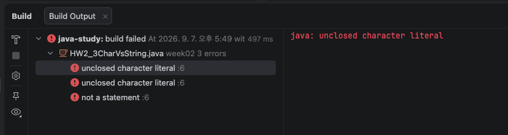

#### - 추가 설명
'ab'와 같이 글자가 두 개 이상 들어가면, 자바 컴파일러는 첫 번째 글자 뒤에 바로 홑따옴표(')가 닫힐 것으로 예상함.   
예상치 못한 b와 세미콜론(;)이 나타나면서 문자 리터럴이 제대로 끝나지 않았다는 뜻의 unclosed character literal 오류가 발생함.     

1. char는 숫자 (번호표 상자)   
   자바에서 char(문자형)는 화면에 글자처럼 보이지만, 컴퓨터 내부에는 그 글자의 번호표(숫자)로 저장. 
예를 들어 영어 대문자 'A'는 컴퓨터 내부에서 65번이라는 숫자로 관리됨.   
그래서 'A' + 1을 하면 글자가 더해지는 게 아니라 숫자 65 + 1이 되어서 66이 될 수 있고, 반대로 66이라는 숫자를 char 상자에 넣으면 컴퓨터가 알아서 66번 번호표에 해당하는 글자('B')를 꺼내 보여주는 것.

2. char와 String의 결정적 차이
- char (작은따옴표 ' ')
번호표 딱 1개만 들어가는 고정 크기의 상자. 
글자 딱 한 글자만 담을 수 있어서 크기가 고정.

- String (큰따옴표 " ")    
char 상자 여러 개를 기차처럼 줄줄이 엮어 놓은 묶음(객체).    
글자가 한 글자든, 열 글자든, 문장이 통째로 들어가든 길이가 자유롭다는 특징이 있음.   

3. 따옴표가 다른 이유   
- 작은따옴표(' '): "이 안에는 딱 하나의 번호표(char)만 들어간다"는 것을 컴퓨터에게 알려주는 표시. (예: 'A', '홍')   
- 큰따옴표(" "): "이 안에는 여러 개의 글자가 엮여 있는 문자열(String 묶음)이다"라는 것을 알려주는 표시. (예: "A", "홍길동", "Hello")   
***

### 2-4. final
final로 선언한 변수의 값을 바꿔 보고 오류 메시지를 적으세요.   
final 이 왜 필요한지 한 줄로 쓰세요.

#### - 오류 메시지 
```
java: cannot assign a value to final variable MAX (HW2_4FinalExample.java:7) 
```
final은 값이 바뀌면 안되는 중요한 데이터나 값을 고정하여 안정성을 높이고 실수를 방지

#### - 실행 결과
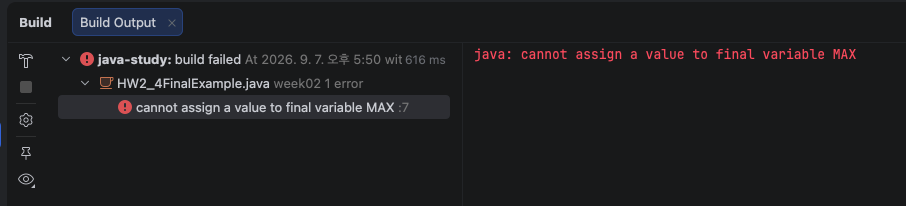
***

### 2-5. 값 돌려 바꾸기
변수 3개의 값을 서로 돌려 바꾸세요.   
a -> b,  b -> c,  c -> a   
바꾸기 전과 후를 각각 출력해서 확인하세요.

#### - 실행 결과   
바꾸기 전   

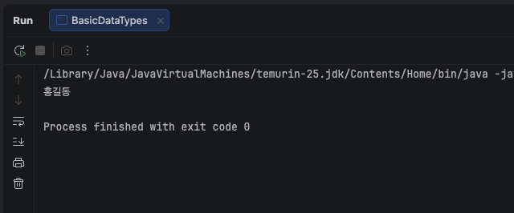

바꾼 후   

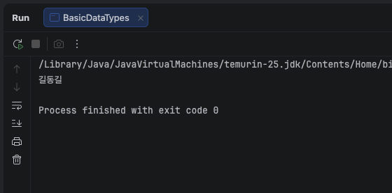

#### - 오답 재실행
```java
String a = "홍";
String b = "길";
String c = "동";

System.out.println("전 " + "" + a + b + c);

String temp = c; // 마지막 값('동')을 temp에 백업
c = b;         // b의 값('길')을 c에 넣음
b = a;         // a의 값('홍')을 b에 넣음
a = temp;      // 백업해 둔 '동'을 a에 넣음

System.out.println("후 " + "" + a + b + c);
```
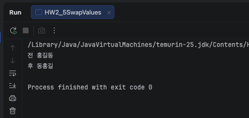
***

## 도전 과제
### 도전 1. 흔한 실수 4개 직접 내보기
아래 네 줄을 그대로 쳐서 오류를 확인하고, 각각 어떻게 고치는지 적으세요.   
이 네 개가 이번 주 오류 실험입니다.
```
  char c = "A";
  String s = 'abc';
  long n = 10000000000;
  float f = 3.14;
```
#### - 오류 메시지 
```
java: unclosed character literal (C1CommonMistakes.java:7)
java: unclosed character literal (C1CommonMistakes.java:7)
java: not a statement (C1CommonMistakes.java:7)
java: integer number too large (C1CommonMistakes.java:8)
```

#### - 실행 결과
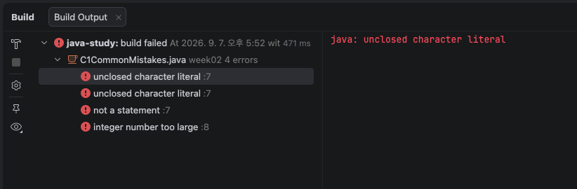

#### - 오류 수정 방법
``` java
char c = 'A'; // ""를 ''로 수정
String s = "abc"; // ''을 ""로 수정
long n = 10000000000L; // 뒤에 L 붙임
float f = 3.14f; // 뒤에 f 붙임
```
#### - 추가설명 

- Line 7 관련 에러 (java: unclosed character literal, java: not a statement)   
  - 원인: 자바는 작은따옴표(')를 오직 한 글자(char)를 감쌀 때만 허용.    
그런데 String s = 'abc';처럼 여러 글자를 작은따옴표로 묶으면, 자바는 중간에 따옴표가 닫히지 않은 줄 알거나(unclosed character literal),    
문법 구조가 완전히 깨져서 온전한 명령문으로 인식하지 못하게 됨(not a statement).   
  - 올바른 형태: char에는 작은따옴표로 한 글자('A'), String에는 큰따옴표로 문자열("abc")을 넣어야 함.

- Line 8 관련 에러 (java: integer number too large)   
  - 원인: 자바는 코드에 적힌 정수 숫자(예: 10000000000)를 기본적으로 int 타입으로 간주함.   
하지만 100억이라는 숫자는 int가 담을 수 있는 최대 크기(약 21억)를 훨씬 초과하기 때문에, 컴파일러가 "숫자가 너무 커서 int에 담을 수 없다"며 에러를 발생시킴. 
  - 해결 방법: 숫자 뒤에 대소문자 L(또는 l)을 붙여서 long n = 10000000000L;로 적어주어야 함.

- float f = 3.14; 에러가 안 나온 이유   
  - 자바 컴파일러는 위에서부터 차례대로 에러를 검사하다가 심각한 문법/타입 에러(Line 7, 8)를 만나면 컴파일을 중단하거나 뒤쪽 코드는 제대로 검사하지 못함. 
  - 만약 7, 8번 줄의 에러를 먼저 고치고 실행하면, float f = 3.14;에서도 incompatible types: possible lossy conversion from double to float (더블형을 플롯형에 넣으면 데이터 손실이 날 수 있다는 에러)가 추가로 발생하게 됨.   

#### - 7, 8 줄 주석 처리 후 나온 결과
```java
 char c = "A";
 // String s = 'abc';
 // long n = 10000000000;
 float f = 3.14;
```
```
java: incompatible types: java.lang.String cannot be converted to char (C1CommonMistakes.java:6)
java: incompatible types: possible lossy conversion from double to float (C1CommonMistakes.java:9)
```

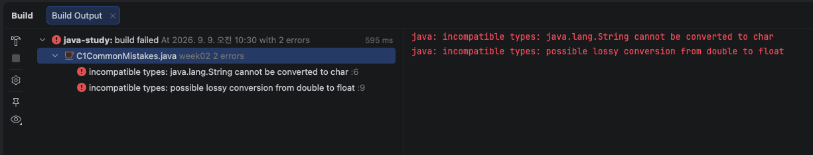
***

### 도전 2. 변수 이름 규칙
아래 이름들을 직접 선언해 보고, 안 되는 것과 그 이유를 적으세요.
```
 userName    2age    my-name    int    Age    MAX_SIZE
```
#### - 오류 메시지
```
java: not a statement (C2NamingRules.java:7)
java: ';' expected (C2NamingRules.java:7)
java: ';' expected (C2NamingRules.java:8)
java: not a statement (C2NamingRules.java:9)
java: ';' expected (C2NamingRules.java:9)
java: not a statement (C2NamingRules.java:9)
java: ';' expected (C2NamingRules.java:9)
```
#### - 실행 결과
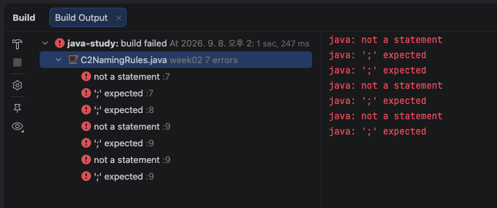

#### - 설명
```java
String userName = "홍길동"; // 변수 선언 가능
int 2age = 20; // 변수명이 숫자로 시작 할 수 없음
String my-name = "홍길동"; // 변수명에 - 을 포함 할 수 없음
float int = 3.14f; // 변수명에 예약어 사용할 수 없음
long Age = 10L; // 변수 선언 가능하나 대문자로 시작하면 클래스로 혼돈될 수 있어 사용하지 않음
int MAX_SIZE = 100; // 변수 선언가능하나 앞에 final을 붙여야함
```
| 구분   | 예시               | 설명                              |
|--------|--------------------|-----------------------------------|
| 클래스 | Study, ReportCard  | 첫 글자 대문자                    |
| 변수   | userName, maxSize  | 첫 글자 소문자                    | 
| 상수   | MAX_SIZE           | 전부 대문자 + 밑줄, final 과 함께 | 
| 메서드 | getName, printCard | 첫 글자 소문자, 동사로 시작       | 

***

### 도전 3. 성적표 출력
- 이름, 국어, 영어, 수학을 변수에 넣고 총점과 평균을 계산해 출력하세요.   
  조건: 점수를 바꿀 때 맨 위 4줄만 고치면 되도록 만들 것.   
  println 안에 숫자를 직접 쓰면 안 됩니다.

#### - 작성 코드
```java
String studentName = "홍길동";
double kor = 90;
double eng = 95.5;
double mat = 100;
final int SUBJECT_COUNT = 3;
double total = kor + eng + mat;
double avg = total / SUBJECT_COUNT;
        System.out.println("이름 " + studentName);
        System.out.println("총점 " + total);
        System.out.println("평균 " + avg);
```
#### - 실행 결과
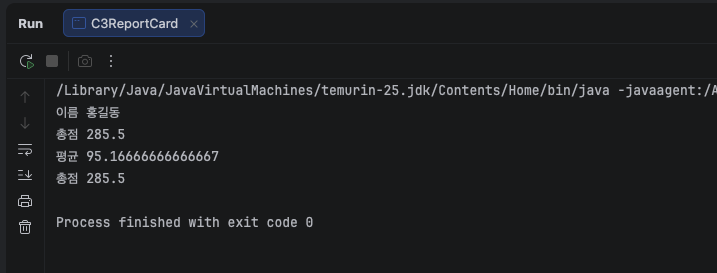
***

## 제출 전 확인
- [x] public static void main 이 맞는가
- [x] 파일명과 클래스명이 같은가
- [x] 모든 문장 끝에 세미콜론이 있는가
- [x] char 는 작은따옴표, String 은 큰따옴표인가
- [x] long 뒤에 L, float 뒤에 f 를 붙였는가
- [x] 변수 이름이 카멜 표기법인가
- [x] 오류 메시지를 줄 번호까지 적었는가
