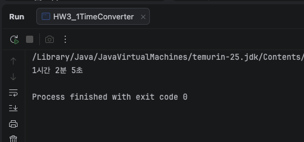
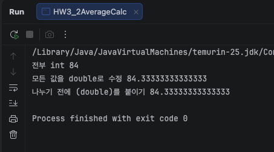
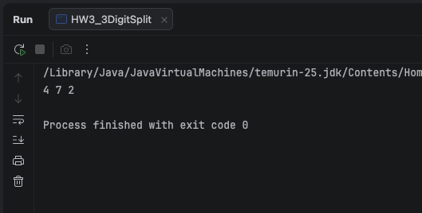
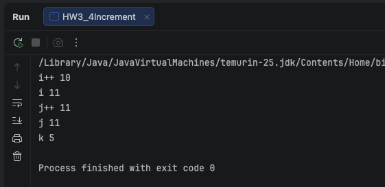
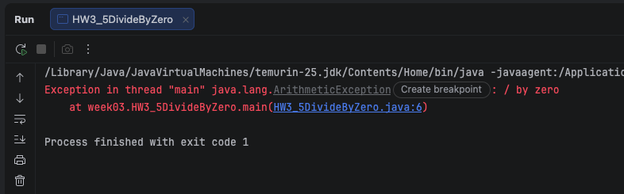
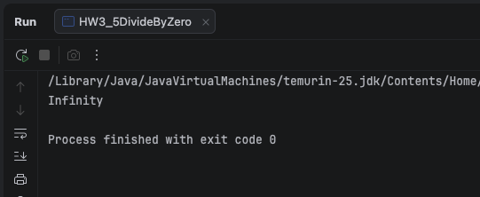
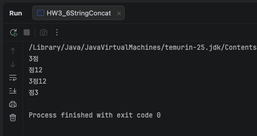
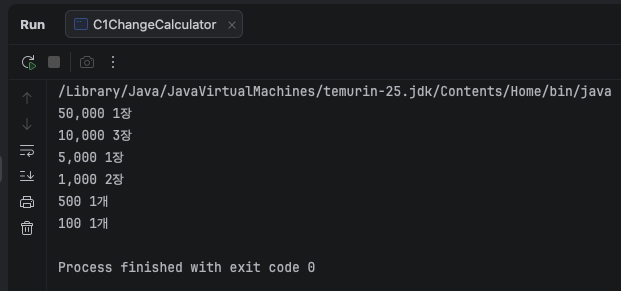
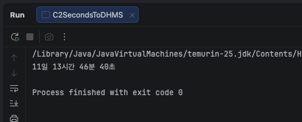
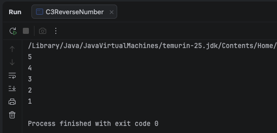

# Week 03 연산자 (1) 산술·대입·증감
***
## 학습 기간
2026-09-14 ~ 2026-09-21
***

## 과제 내용
### 3-1. 초를 시·분·초로    
3725초를 아래 형태로 출력하세요.   
```text
1시간 2분 5초
```
조건: / 와 % 만 쓸 것. 손으로 계산한 숫자를 적으면 안 됩니다.   
힌트: 3600으로 나누면 시간, 남은 걸로 분을 구합니다.   
※ 입력받는 건 5주차(Scanner)에서 합니다.
지금은 int total = 3725; 로 두고 시작하세요.


#### - 실행 결과

***

### 3-2. 정확한 평균   
국어 85, 영어 90, 수학 78 의 평균을 소수점까지 출력하세요.   

조건: 두 번 실행해서 결과를 둘 다 적을 것.   

① 전부 int 로만 해서 실행   →  결과가 뭐라고 나오나요?   
② 고쳐서 다시 실행          →  어떻게 고쳤나요?   

①을 건너뛰지 마세요. 그게 이번 주에 봐야 할 겁니다.   
오류가 안 나는데 답이 틀리는 경우입니다.

#### - 실행 결과
```
전부 int 84
모든 값을 double로 수정 84.33333333333333
나누기 전에 (double)를 붙이기 84.33333333333333
```

***

### 3-3. 자릿수 분해   
세 자리 수 472 를 백·십·일의 자리로 나눠 출력하세요.
```text
4 7 2
```
조건: % 와 / 만 쓸 것.

#### - 실행 결과

***

### 3-4. i++ 와 ++i   
둘의 차이를 코드로 증명하고, 결과를 주석으로 설명하세요.   
그리고 이것도 해보세요.
```java
int i = 5;
i = i++;
System.out.println(i);
```
결과가 예상과 같나요? 다르면 왜 그런지 한 줄로 쓰세요.   
힌트: 지난주 2-5 에서 한 얘기랑 이어집니다. = 는 넣어라, 였죠. 

#### - 설명
실제 테스트 코드는 k로 진행함   
대입 연산자 = 는 오른쪽 값을 왼쪽에 넣는 개념   
그래서 k의 결과를 6으로 예상함   
하지만 결과는 5로 출력됨    
후위 연산자는 k를 먼저 쓰고 나중에 1을 더함   
k의 값 5를 임시 저장 후 원래 k는 6이 됨    
대입 연산시 임시 저장했던 5가 k에 대입되어 다시 5가 됨


#### - 실행 결과

***

### 3-5. 0으로 나누기
아래 두 줄을 각각 실행하고 결과를 적으세요.   
```
1. System.out.println(10 / 0);   
2. System.out.println(10.0 / 0); 
```
하나는 터지고 하나는 안 터집니다.   
→ 터지는 쪽은 오류 메시지를 그대로 + 줄 번호까지   
→ 안 터지는 쪽은 뭐라고 출력되는지   
→ 왜 다른지 한 줄로 정리  

※ 이건 지금까지 본 오류랑 종류가 다릅니다.   
컴파일은 됩니다. 실행하다가 터집니다. 그 차이도 적어보세요.

#### - 1번 오류 메시지 (줄번호 포함)
```
Exception in thread "main" java.lang.ArithmeticException: / by zero
	at week03.HW3_5DivideByZero.main(HW3_5DivideByZero.java:6)
```
#### - 1번 실행 결과



#### - 2번 실행 결과
```
Infinity
```


#### - 1번과 2번 차이점 
1번: 10과 0이 모두 정수(int)   
2번: 10.0이 실수이고 뒤의 0이 0.0으로 자동 전환되어 10.0 / 0.0으로 계산   
정수 나눗셈(10 / 0)은 수학적으로 불가능하여 예외(ArithmeticException)를 내며 터지지만      
실수 나눗셈(10.0 / 0)은 IEEE 754 부동소수점 표준에 따라 무한대 값인 Infinity를 반환하며 정상 작동함
***

### 3-6. 계산 순서
아래 네 줄의 결과를 먼저 예상해서 적고, 그 다음 실행해서 확인하세요.
```java
System.out.println(1 + 2 + "점");
System.out.println("점" + 1 + 2);
System.out.println(1 + 2 + "점" + 1 + 2);
System.out.println("점" + (1 + 2));
```
예상이 틀린 게 있으면 왜 틀렸는지 쓰세요.
전부 맞았으면 "왜 그런지" 를 한 줄로 설명해 보세요.

#### - 결과 예상
```java
System.out.println(1 + 2 + "점"); // 3점 (숫자가 먼저 나왔으니 계산 하고 문자를 붙임)
System.out.println("점" + 1 + 2); // 점12 (문자가 먼저나오면 문자로 변환되어 붙임)
System.out.println(1 + 2 + "점" + 1 + 2); // 3점12 (숫자 먼저 계산하고 문자가 나왔기때문에 그 이후에 문자로 변환되어 붙임)
System.out.println("점" + (1 + 2)); // 점3 // (괄호로 숫자가 구분 되었기 때문에 숫자계산 후 문자가 붙음)
```
#### - 실행 결과 

***

## 도전 과제
### 도전 1. 거스름돈 계산
87,600원을 아래 단위로 각각 몇 장/개인지 출력하세요.   

```
50,000  10,000  5,000  1,000  500  100
```
조건 1: 금액은 맨 윗줄 하나만 고치면 되도록 만들 것   
      (지난주 성적표에서 한 것과 같은 조건입니다)   
조건 2: 결과를 손으로 검산해서 87600 이 맞는지 확인할 것   

#### - 실행 결과


#### - 검산
```
50,000 * 1장 = 50,000
10,000 * 3장 = 30,000
5,000 * 1장 = 5,000
1,000 * 2장 = 2,000
500 * 1개 = 500
100 * 1개 = 100

50,000 + 30,000 + 5,000 + 2,000 + 500 + 100 = 87,600
```

***

### 도전 2. 초를 일·시·분·초로
1000000초를 아래 형태로 출력하세요.
```
11일 13시간 46분 40초
```
3-1 을 한 단계 늘린 겁니다.

#### - 실행 결과

***

### 도전 3. 숫자 뒤집기
12345 를 54321 로 만드세요.
% 와 / 만 쓸 것.   
***

#### - 실행 결과

***

## 제출 전 확인
- [x] 평균이 소수점까지 나오는가
- [x] (double) 을 나누기 전에 붙였는가
- [x] % 를 써서 풀었는가 (손으로 계산한 숫자를 안 적었는가)
- [x] 3-2 의 ① 결과도 같이 적었는가
- [x] 도전1 결과를 손으로 검산했는가
- [x] 오류 메시지를 줄 번호까지 텍스트로 적었는가
- [x] 맨 윗줄 값만 고치면 결과가 따라오는가
***