# Week 04 연산자 (2) 비교·논리·형변환
***
## 학습 기간
2026-09-21 ~ 2026-09-28
***

## 과제 내용
### 4-1. 비교 연산자
int a = 10, b = 20; 으로 두고 아래 여섯 개를 각각 출력하세요.   
```java
  a > b    a < b    a == b    a != b    a >= 10    b <= 19
```
조건 1: 결과를 손으로 true/false 라고 적으면 안 됩니다. 식을 그대로 println 에 넣을 것   
조건 2: 여섯 개 중 하나는 boolean 변수에 먼저 담았다가 출력할 것   
그 변수 이름은 지난번 2-1 피드백대로 is~ 로 시작하게 지으세요   
출력된 게 true/false 인데, 이건 무슨 자료형인가요? 한 줄로 적으세요   

#### - 실행 결과
true/false의 자료형은 참/거짓 두 가지 값만 가질 수 있는 boolean(논리형)입니다.    

```java
 a > b false
 a < b true
 a == b false
 a != b true
 a >= 10 true
 b <= 19 false
```
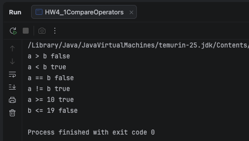
***

### 4-2. 논리 연산자
int age = 20;  boolean hasTicket = true;  로 두고 아래 세 개를 출력하세요.   
```java
    age >= 19 && hasTicket
    age >= 19 || hasTicket
    !hasTicket
```
그 다음 age 를 15 로 바꿔서 다시 실행하세요.   
조건: 실행하기 전에 여섯 개 결과를 먼저 예상해서 적은 후 그 다음 실행.     
&& 와 || 가 언제 갈리는지 한 줄로 정리하세요. 

&&는 하나라도 거짓(false)이면 나머지를 안봄        
||는 하나라도 참(true)이면 나머지를 안봄

#### - 결과 예상
```java
   int age = 20;      
   boolean hasTicket = true;
   age >= 19 && hasTicket   // true
   age >= 19 || hasTicket   // true
   !hasTicket   // false
   
   int age = 15;
   age >= 19 && hasTicket   // false
   age >= 19 || hasTicket   // true
   !hasTicket   // false
```
#### - 실행 결과
``` java
    int age = 20;
    age >= 19 && hasTicket -> true
    age >= 19 || hasTicket -> true
    !hasTicket -> false

    int age = 15;
    age >= 19 && hasTicket -> false
    age >= 19 || hasTicket -> true
    !hasTicket -> false
```
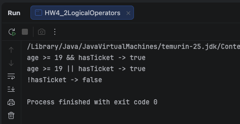
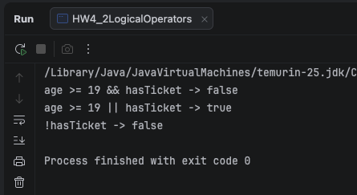
***

### 4-3. 자동 형변환
아래를 한 줄씩 실행하고 결과를 적으세요.

#### * 형변환 크기 순서
```text
byte (1B) ──┐
            ├─► short (2B) ──► int (4B) ──► long (8B) ──► float (4B) ──► double (8B)
char (2B) ──┘
```

| 방향            | 이름        | 표기       | 손실 |
|-----------------|-------------|------------|------|
| 작은 것 → 큰 것 | 자동 형변환 | 안 써도 됨 | 없음 |
| 큰 것 → 작은 것 | 강제 형변환 | (int)      | 있음 |

```java
    int i = 10;
    double d = i;
    System.out.println(d);
    
    char c = 'A';
    int n = c;
    System.out.println(n);
    
    System.out.println('A' + 1);
    System.out.println((char)('A' + 1));
    
    double r1 = 10 / 4;
    double r2 = 10 / 4.0;
    System.out.println(r1);
    System.out.println(r2);
```
물어보는 건 세 개입니다.

① 'A' + 1 이 왜 문자가 아니라 숫자로 나오나요    
char타입과 int타입 연산시 더 큰 int타입으로 형변환 되고   
65 + 1가 연산되어 66이 됨

② r1 은 double 인데 왜 2.5 가 아닌가요      ← 지난주 3-2 가 여기 또 나옵니다   
--> 10 / 4 연산을 먼저 실행 int/int이기 때문에 소수점 이하를 버리고 2가됨     
2가 된 후 double 타입이 지정되고 2.0이   됨

③ 자바는 어느 방향으로만 알아서 바꿔주나요. 한 줄로.  
-->  작은 것 -> 큰 것

#### - 실행 결과
```java
    int i = 10;
    double d = i;
    System.out.println(d);  // 10.0
    
    char c = 'A';
    int n = c;
    System.out.println(n); // 65
    
    System.out.println('A' + 1); //66
    System.out.println((char)('A' + 1)); // B
    
    double r1 = 10 / 4;
    double r2 = 10 / 4.0;
    System.out.println(r1); // 2.0
    System.out.println(r2); // 2.5
```
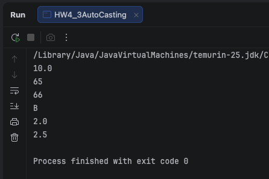
***

### 4-4. 강제 형변환
아래를 실행하고 결과를 적으세요.   
```java
    double pi = 3.99;
    int x = (int) pi;
    System.out.println(x);

    int big = 300;
    byte small = (byte) big;
    System.out.println(small);
```

① 3.99 가 4 가 아니라 뭐가 나오나요. 반올림인가요 아닌가요.     
--> 3이 출력되었으며 반올림 아님   

② 300 을 byte 에 넣으면 이상한 수가 나옵니다. 왜 그 수인지 한 줄로.      
힌트: byte 는 -128 ~ 127. 256 을 빼보세요.        
지난주 2-2 에서 int 21억 넘긴 것과 같은 종류입니다.   
--> byte의 표현 범위를 초과하여 오버플로우 발생  
300-256 = 44가 나옴   


### - 실행 결과
```
    3
    44
```
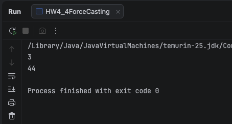
***

### 4-5. 오류 두 개
아래 두 줄을 각각 넣고 컴파일하세요.   
```java
    int x = 3.7;
    byte b = 128;
```
① 오류 메시지를 그대로 + 줄 번호까지 (지난주처럼 텍스트로)   
-->
```
java: incompatible types: possible lossy conversion from double to int:6
java: incompatible types: possible lossy conversion from int to byte:7
```

② 메시지 안에 lossy 라는 단어가 있습니다. 무슨 뜻인지 찾아서 한 줄로   
--> lossy[ˈlɔːsi]   
형용사   
1.<소재·운송 경로가> 손실이 많은   

③ 그리고 이것.     
int → double 은 4-3 에서 그냥 됐는데   
double → int 는 왜 막나요. 한 줄로.   
※ 이건 지난주 3-5 와 반대입니다. 컴파일에서 잡힙니다.   
컴파일러가 잡아주는 것과 못 잡는 것의 차이를 다시 한번 보세요.   
--> 큰 타입에서 작은 타입은 강제 형변환이 일어나며 값 손실이 발생하기 때문에 컴파일러가 막아줌       
int → double와 double → int의 차이는 아래 표 내용 때문임   

| 방향            | 이름        | 표기       | 손실 |
|-----------------|-------------|------------|------|
| 작은 것 → 큰 것 | 자동 형변환 | 안 써도 됨 | 없음 |
| 큰 것 → 작은 것 | 강제 형변환 | (int)      | 있음 |


### - 오류 메시지
```
java: incompatible types: possible lossy conversion from double to int:6
java: incompatible types: possible lossy conversion from int to byte:7
```
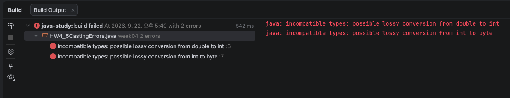
***

### 4-6. == 의 함정
아래 세 줄의 결과를 먼저 예상해서 적고, 그 다음 실행해서 확인하세요.    
```java
    System.out.println(10 == 10.0);
    System.out.println('A' == 65);
    System.out.println(0.1 + 0.2 == 0.3);
```
세 번째가 함정입니다.   
틀렸으면 System.out.println(0.1 + 0.2); 를 찍어보세요. 이유가 보입니다.   
본 대로 적으세요. "왜 그런지" 는 한 줄이면 됩니다. 깊이 안 들어가도 됩니다.
※ = 와 == 는 다릅니다.   
지난주 "= 는 넣어라" 였죠. == 는 "같냐고 묻는 것" 입니다.   
a = 10 은 넣는 거고, a == 10 은 물어보는 겁니다.  

#### - 결과 예상
```java
    System.out.println(10 == 10.0); // true (int == double 작은 것 → 큰 것 이기 때문에 자동 형변환 되어 10.0 == 10.0 이므로) 
    System.out.println('A' == 65); // true (A는 실제로 65이고 char에서 int로 형변환 되어  65 == 65임 )
    System.out.println(0.1 + 0.2 == 0.3); // false (결과 예상은 맞았으나 예상 과정이 틀렸음 0.1 + 0.2 = 0.30000000000000004)

```
### - 실행 결과
```
    true
    true
    false
```
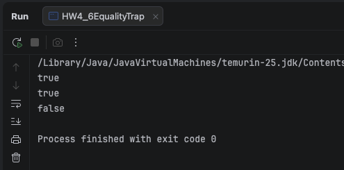
***

## 도전 과제
### 도전 1. 삼항 연산자
조건문은 10주차에 배우는데, 이건 연산자라서 지금 됩니다.   
```java
    int score = 85;
    String result = score >= 60 ? "합격" : "불합격";
    System.out.println(result);
```
score 를 59 로 바꿔서 두 번 실행하세요.   
그리고 지난주 % 로 하나 더.   
int number = 7;   →  "홀수" 또는 "짝수" 가 나오게   
조건: 맨 윗줄 값만 고치면 결과가 따라오게 만들 것.   

#### - 실행 결과
```
    1. int score = 85; 실행 결과 --> 합격
    2. int score = 59; 실행 결과 --> 불합격
```

```java 
    int number = 7;
    String resultNumber = (number % 2 == 0) ? "짝수" : "홀수";
    System.out.println(resultNumber); // 실행 결과: 홀수
```


***

### 도전 2. 윤년
아래 규칙을 && 와 || 로 한 줄에 쓰세요.   
```text
    4 로 나눠떨어지면 윤년
    그런데 100 으로도 나눠떨어지면 윤년 아님
    그런데 400 으로도 나눠떨어지면 다시 윤년
```
2024, 1900, 2000 세 개를 넣어서 결과를 적으세요.   
조건 1: 결과를 boolean 변수에 담을 것. 이름은 is~ 로.   
조건 2: 세 개 결과가 왜 그런지 손으로 검산해서 적을 것.   
1900 은 100 으로 나눠떨어지니까 ... 이런 식으로.   
힌트: 괄호 위치가 답을 바꿉니다. 괄호 없이도 한 번 돌려보세요.  

#### - 실행 결과
``` 
1. 1900 결과
   윤년 ❌
   
2. 2000 결과
   윤년 ⭕
   
3. 2024 결과
   윤년 ⭕
   
4. 괄호 없는 결과
   1900 결과 --> 윤년 ❌
   2000 결과 --> 윤년 ⭕
   2024 결과 --> 윤년 ⭕
```
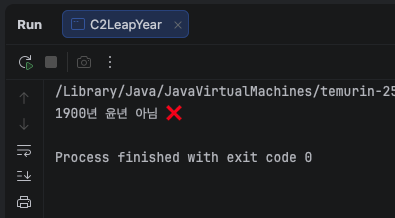
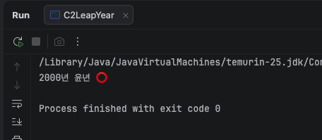
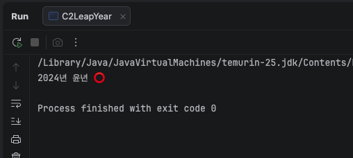

#### - 검산
```
1. 1900
   1900 % 4 = 0  (4 로 나눠떨어지면 윤년 ⭕)
   1900 % 100 = 0  (100 으로 나눠떨어지면 평년 ⭕)
   1900 % 400 = 300  (400 으로 나눠떨어지면 윤년 ❌)
   (true && false) || false --> false (윤년 ❌)
   
2. 2000
   2000 % 4 = 0  (4 로 나눠떨어지면 윤년  ⭕)
   2000 % 100 = 0  (100 으로 나눠떨어지면 평년 ⭕)
   2000 % 400 = 0  (400 으로 나눠떨어지면 윤년  ⭕)
   (true && false) || true --> true (윤년 ⭕)
   
3. 2024
   2024 % 4 = 0  (4 로 나눠떨어지면 윤년 ⭕)
   2024 % 100 = 24 (100 으로 나눠떨어지면 평년 ❌)
   2024 % 400 = 24  (400 으로 나눠떨어지면 윤년 ⭕)
   (true && true) || false --> true (윤년 ⭕)
   
```
***

### 도전 3. 문자 ↔ 숫자
아래를 실행하고 결과를 적으세요.   
```java
    char digit = '7';
    System.out.println(digit - '0');
    System.out.println(digit + 1);
    System.out.println((char)(digit + 1));

    char lower = 'a';
    System.out.println((char)(lower - 32));
```
① '7' - '0' 이 왜 7 이 되나요. 아스키 표를 찾아서 한 줄로.    
-->  char 타입끼리 빼기 연산을 하면 내부 아스키(유니코드) 숫자 값으로 연산   
7의 아스키코드 값 55  
0의 아스키코드 값 48   
55 - 48 = 7   

② 소문자에서 32 를 빼면 왜 대문자가 되나요.   
5주차에 키보드로 입력받으면 숫자도 글자로 들어옵니다.   
그걸 진짜 숫자로 바꿀 때 이게 쓰입니다. 미리 봐두는 겁니다.   
-->
a의 아스키코드 값 97   
A의 아스키코드 값 65
두 값의 차이는 32이기때문에 소문자에서 32를 빼면 65가 되고
char타입으로 형변환 출력하여 A가 됨   
 
#### - 실행 결과
```java
   7
   56
   8
   A
```
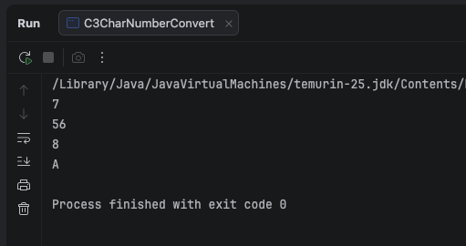
***

## 힌트
이번 주 핵심은 이 두 줄입니다.   

작은 그릇 → 큰 그릇     자바가 알아서 바꾼다. 말 안 한다.
큰 그릇 → 작은 그릇     내가 (int) 를 붙여야 한다. 그리고 잘린다.

```text
byte  <  short  <  int  <  long  <  float  <  double
                   char  →  int
```

```java
    int i = 10;  double d = i;         // →  10.0     알아서
    double d = 3.99;  int i = d;       // →  오류     못 한다
    double d = 3.99;  int i = (int) d; //  →  3     시키면 한다. 대신 잘린다
```

(int) 는 반올림이 아닙니다. 자릅니다.   

(int) 3.99     →   3   
(int) -3.99    →  -3   

지난주 정수 나누기에서 소수점이 잘린 것과 같은 일입니다.   
지난주는 나누기가 잘랐고, 이번 주는 (int) 가 자릅니다.   


비교 연산의 결과는 boolean 입니다.   

boolean isAdult = age >= 19;   

true 와 "true" 는 다릅니다. 하나는 참/거짓이고 하나는 글자입니다.   
비교 결과를 String 에 담으려고 하면 오류 납니다. 한 번 해보세요.   


문자는 사실 숫자입니다.   

'A'  =  65   
'a'  =  97   
'0'  =  48   

char 를 계산에 넣는 순간 int 가 됩니다. 그래서 'A' + 1 은 66 입니다.   
다시 문자로 보려면 (char) 를 붙여야 합니다.   


지난주에 얘기한 것 이어서   

□ 도전3 은 54321 이라는 "숫자" 를 만들어서 다시 올려주세요   
 reversed = reversed * 10 + number % 10   
□ 변수 이름은 카멜. kor_int 아니고 korInt. 그리고 evg 아니고 avg   
□ 출력 라벨은 코드랑 똑같이. 코드가 ++j 면 화면도 ++j   
□ 결과 숫자는 캡처만 말고 README 에 글자로도 한 줄   
□ 커밋 전에 Ctrl + Alt + L 한 번 (맥은 Cmd + Option + L)   
□ 4-2, 4-6 은 꼭 예상부터 적고 실행   
***

## 제출 전 확인
- [x] 비교 결과를 손으로 안 적고 식으로 출력했는가
- [x] 4-2, 4-6 예상을 실행 전에 적었는가
- [x] (int) 가 반올림이 아니라 자르는 것을 확인했는가
- [x] 오류 메시지를 줄 번호까지 텍스트로 적었는가
- [x] boolean 변수 이름이 is~ 로 시작하는가
- [x] 도전2 결과 세 개를 손으로 검산했는가
- [x] 맨 윗줄 값만 고치면 결과가 따라오는가
- [x] 지난주 도전3 을 숫자로 다시 올렸는가
***