# Week 05 입력받기와 Scanner

## 학습 기간
2026-09-28 ~ 2026-10-05
***

| 항목 | 기능 및 설명 | 버퍼 처리 및 주요 특징 | 사용 예시 코드 |
|---|---|---|---|
| `Scanner` | 키보드(`System.in`)로부터 다양한 입력 데이터를 읽어오는 클래스 | `java.util` 패키지에 위치하며, 객체 생성 시 `System.in` 연결 필요 | `Scanner sc = new Scanner(System.in);` |
| `import` | 외부 패키지에 선언된 클래스를 현재 파일로 가져오겠다는 선언 | 자바 기본 제공 클래스를 불러올 때 최상단에 작성 | `import java.util.Scanner;` |
| `nextInt()` | 정수(`int`) 하나를 읽어옴 | 공백 및 엔터 전까지의 숫자만 읽음 (엔터 `\n`는 버퍼에 남김) | `int age = sc.nextInt();` |
| `nextDouble()` | 실수(`double`) 하나를 읽어옴 | 공백 및 엔터 전까지의 실수 숫자만 읽음 (앞의 엔터/공백은 무시함) | `double height = sc.nextDouble();` |
| `next()` | 공백(스페이스, 탭, 엔터) 전까지의 단어 하나를 읽어옴 | 공백을 구분자(Delimiter)로 인식하여 띄어쓰기 전까지만 가져옴 | `String firstName = sc.next();` |
| `nextLine()` | 엔터(`\n`)를 만날 때까지 한 줄 전체를 읽어옴 | 공백을 포함하며, 엔터까지 읽어서 버퍼를 깨끗이 비움 | `String name = sc.nextLine();` |
| `nextBoolean()` | 논리값(`true` / `false`) 하나를 읽어옴 | `true` 또는 `false` 문자열 형태의 입력만 처리 가능 | `boolean isStudent = sc.nextBoolean();` |
| `close()` | 사용이 끝난 `Scanner` 객체와 입력 스트림을 닫음 | 사용 완료 후 메모리 자원 반납 (Resource Leak 방지) | `sc.close();` |

**💡 nextInt() / nextDouble() 사용 후 nextLine()을 쓸 때:**   
앞선 메서드들이 입력 버퍼에 남겨둔 엔터(\n) 때문에 nextLine()이 빈 문자열을 읽고 바로 넘어가는 현상이 발생함.   
이 경우 중간에 sc.nextLine();을 한 줄 추가하여 남아있는 엔터를 지워주어야 함.  
```java
int age = sc.nextInt(); // 숫자만 읽고 엔터(줄바꿈)를 남겨둠
sc.nextLine(); // ★ 남은 엔터를 지움
String name = sc.nextLine();
```
### printf 서식 문자 (Format Specifier)

| 서식 | 뜻 | 예시 코드 | 출력 결과 | 설명 |
|---|---|---|---|---|
| `%d` | 정수 (10진수) | `printf("[%5d]", 42)` | `[   42]` | `byte`, `short`, `int`, `long` 모두 사용 가능. 폭(5) 지정 시 기본 **오른쪽 정렬** |
| `%f` | 실수 | `printf("%.2f", 3.14159)` | `3.14` | 기본 소수점 **6자리** 출력. `.2`처럼 자릿수 지정 시 **반올림** 처리 |
| `%s` | 문자열 | `printf("[%-10s]", "Java")` | `[Java      ]` | 모든 객체 가능(`toString()` 결과 출력). `-` 플래그로 **왼쪽 정렬** |
| `%c` | 문자 | `printf("%c", 'A')` | `A` | `char` 또는 유니코드 정수값(`65` → `A`)도 가능 |
| `%b` | 불린 | `printf("%b", true)` | `true` | `null`이면 `false`, 그 외 `Boolean`이 아닌 값은 모두 `true` |
| `%n` | 줄바꿈 | `printf("Hi%n")` | `Hi` + 줄바꿈 | OS에 맞는 줄바꿈 문자 출력 → `\n`보다 **권장** |
| `%%` | 퍼센트 기호 | `printf("%d%%", 50)` | `50%` | `%`는 서식 기호이므로 문자 그대로 쓰려면 두 번 입력 |

<!--
| `%e` | 실수 (지수 표기) | `printf("%e", 12345.678)` | `1.234568e+04` | 매우 크거나 작은 수를 과학적 표기법으로 출력 |
| `%x` / `%X` | 16진수 | `printf("%x", 255)` | `ff` | `%X`는 대문자(`FF`) 출력 |
| `%o` | 8진수 | `printf("%o", 8)` | `10` | 정수를 8진수로 변환 |
-->

[//]: # (### 플래그 &#40;Flag&#41; 및 폭·정밀도 조합)

[//]: # ()
[//]: # (| 형식 | 의미 | 예시 코드 | 출력 결과 |)

[//]: # (|---|---|---|---|)

[//]: # (| `%5d` | 최소 5칸 확보, 오른쪽 정렬 | `printf&#40;"[%5d]", 7&#41;` | `[    7]` |)

[//]: # (| `%-5d` | 최소 5칸 확보, 왼쪽 정렬 | `printf&#40;"[%-5d]", 7&#41;` | `[7    ]` |)

[//]: # (| `%05d` | 빈칸을 0으로 채움 | `printf&#40;"%05d", 7&#41;` | `00007` |)

[//]: # (| `%+d` | 양수에도 부호 표시 | `printf&#40;"%+d", 7&#41;` | `+7` |)

[//]: # (| `%,d` | 천 단위 구분 쉼표 | `printf&#40;"%,d", 1234567&#41;` | `1,234,567` |)

[//]: # (| `%10.2f` | 전체 10칸, 소수점 2자리 | `printf&#40;"[%10.2f]", 3.14159&#41;` | `[      3.14]` |)

[//]: # (| `%.3s` | 문자열 앞 3글자만 출력 | `printf&#40;"%.3s", "Hello"&#41;` | `Hel` |)

[//]: # (### 주의사항)

[//]: # ()
[//]: # (| 항목 | 내용 |)

[//]: # (|---|---|)

[//]: # (| 타입 불일치 | `%d`에 실수&#40;`3.5`&#41;를 넣거나 `%f`에 정수&#40;`3`&#41;를 넣으면 `IllegalFormatConversionException` 발생 |)

[//]: # (| 인자 개수 부족 | 서식 개수보다 인자가 적으면 `MissingFormatArgumentException` 발생 |)

[//]: # (| 자동 줄바꿈 없음 | `printf`는 `println`과 달리 줄바꿈을 하지 않으므로 `%n`을 직접 추가 |)

[//]: # (| 문자열로 저장 | 출력 대신 문자열이 필요하면 `String.format&#40;"%.2f", 3.14159&#41;` 사용 &#40;서식 규칙 동일&#41; |)


## 과제 내용
### 5-1. Scanner 첫 사용
이름과 나이를 입력받아서 아래처럼 출력하세요.   

```text
    이름을 입력하세요: 홍길동
    나이를 입력하세요: 20
    홍길동님은 20살입니다.
```
**조건 1: 맨 위에 import java.util.Scanner; 가 필요합니다. 왜 필요한지 한 줄로.**  
외부 패키지에 선언된 클래스를 현재 파일로 가져오겠다는 선언으로 키보드로부터 다양한 입력 데이터를 읽어오는 Scanner클래스를 사용하기 위해 필요함.

**조건 2: 마지막에 sc.close(); 를 넣으세요.**     
⭕

**import 를 빼고 한 번 돌려보세요. 오류 메시지를 적으세요.   
이건 지난주 4-5 와 같은 종류입니까, 3-5 와 같은 종류입니까? 한 줄로...**  
4-5 와 같은 종류   
컴파일러는 코드(형식)만 보고 판단함.      
int x = 3.7 이 타입이 안 맞는 걸 코드만 보고도 아는 것처럼  
Scanner 라는 이름을 import 안 했으면 그 이름이 뭔지 코드만 보고도 알 수 있음.    
그래서 실행 전 컴파일 시점에 잡힘
반면 3-5 (10 / 0) 는 형식은 멀쩡하고 0 이라는 값 때문에 문제가 생기는 거라 값은 실행해봐야 알 수 있어서 컴파일러가
못 잡고 실행 중에 터진다   
컴파일러는 코드를 보고 예외는 값을 본다   

#### - 오류 메시지
```text
HW5_1ScannerBasics.java:8

java: cannot find symbol
  symbol:   class Scanner
  location: class week05.HW5_1ScannerBasics
java: cannot find symbol
  symbol:   class Scanner
  location: class week05.HW5_1ScannerBasics

```
#### - 실행 결과 
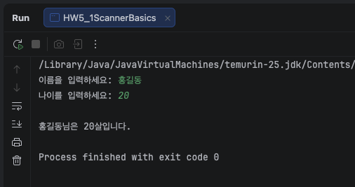
***

### 5-2. 이름이 안 들어온다   
아래를 그대로 쳐서 돌리세요. 순서 바꾸지 마세요.
```java
    Scanner sc = new Scanner(System.in);

    System.out.print("나이: ");
    int age = sc.nextInt();

    System.out.print("이름: ");
    String name = sc.nextLine();

    System.out.println("[" + name + "] " + age);
```
  20 을 넣고 엔터, 그 다음 이름을 넣으려고 하면 이름을 칠 기회도 없이 프로그램이 끝나버립니다.   

  **→ 실제로 뭐가 출력됐는지 그대로 적으세요**   
  **→ 왜 이렇게 되는지 찾아서 적으세요**      
  **→ 고쳐서 이름이 제대로 들어오게 만드세요. 어떻게 고쳤는지 적으세요**   

  힌트: 내가 20 을 치고 엔터를 눌렀을 때, 자바가 가져간 건 20 까지입니다.   
       엔터는 아직 거기 남아 있습니다. nextLine() 이 그 엔터를 읽습니다.   

  ※ 이건 자바 처음 하는 사람이 전부 한 번씩 걸리는 자리입니다.   
    오류가 안 납니다. 그냥 이름이 비어 있습니다.   
    3주차 84 얘기 기억나죠. 그거랑 같은 종류입니다.  

#### - 실행 결과
```text
    나이: 20
    이름: [] 20
```
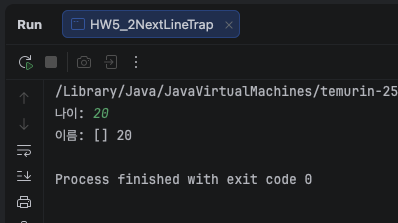

#### - 수정 결과
nextInt() / nextDouble() 사용 후 nextLine()을 쓸 때:   
앞선 메서드들이 입력 버퍼에 남겨둔 엔터(\n) 때문에 nextLine()이 빈 문자열을 읽고 바로 넘어가는 현상이 발생함.   
이 경우 중간에 sc.nextLine();을 한 줄 추가하여 남아있는 엔터를 지워주어야 함.
```java
    Scanner sc = new Scanner(System.in);

    System.out.print("나이: ");
    int age = sc.nextInt();

    sc.nextLine(); // 추가

    System.out.print("이름: ");
    String name = sc.nextLine();

    System.out.println("[" + name + "] " + age);
```
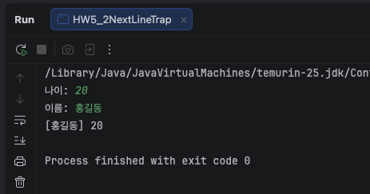
***

### 5-3. next() 와 nextLine()   
아래를 돌리고, 입력으로 "hong gil dong" 을 한 줄에 치세요. (띄어쓰기 포함)   

```java
    String a = sc.next();
    String b = sc.nextLine();
    System.out.println("next=[" + a + "] nextLine=[" + b + "]");
```
**→ 결과를 그대로 적으세요**     
하단 참조   

**→ next() 는 어디까지 읽고 멈추나요. 한 줄로**   
공백 전까지 한 단어

**→ 이름을 입력받을 때 둘 중 뭘 써야 하나요. 왜 그런지 한 줄로**        
nextLine
엔터를 만날 때까지 공백을 포함한 줄 전체를 읽음   

**대괄호 [ ] 로 감싸서 출력한 이유도 생각해보세요.
그냥 찍으면 안 보이는 게 있습니다.**   
공백을 포함 여부를 확인 하기 위해

#### - 실행 결과
```text
    hong gil dong
    next=[hong] nextLine=[ gil dong]
```
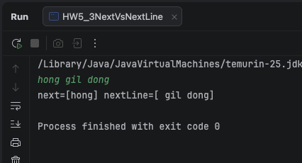
***

### 5-4. 숫자 칸에 글자를 넣으면   
나이를 nextInt() 로 받는 코드를 돌리고, 나이에 abc 라고 치세요.      

**→ 오류 메시지를 그대로 + 줄 번호까지 (지금까지 하던 대로)**   
하단 참조

**→ 이 오류는 3-5 의 10 / 0 과 같은 종류입니까, 4-5 의 int x = 3.7 과 같은 종류입니까**      
3-5 의 10 / 0 과 같은 종류   

**→ 왜 그렇게 생각하는지 한 줄로**      
값이 사용자 입력값으로 결정이 되기 때문에 컴파일러가 미리 예측할 수 없음   

※ 지난주에 두 번 빠뜨린 그 질문입니다. 이번엔 꼭.   
정답을 미리 주자면 이겁니다.   
컴파일러는 코드를 보고, 예외는 값을 본다.   
이 문장을 이번 문제에 대입해서 한 줄로 쓰면 됩니다.   
사용자가 뭘 칠지는 컴파일할 때 알 수가 없죠.   

그리고 at 으로 시작하는 줄이 여러 개 나올 겁니다.   
3주차에 "맨 위가 죽은 자리" 라고 했는데, 이번 건 좀 다릅니다.   

**네 파일 이름이 있는 줄을 찾아보세요. 몇 번째 줄에 있나요.**
네 파일이 뭘까요???   
at week05.HW5_4InputMismatch.main(HW5_4InputMismatch.java:10)      
at으로 시작하는 줄 기준 5번째 줄     


#### - 오류 메시지
```text
    HW5_4InputMismatch.java:10
    나이 입력: abc
    Exception in thread "main" java.util.InputMismatchException
        at java.base/java.util.Scanner.throwFor(Scanner.java:977)
        at java.base/java.util.Scanner.next(Scanner.java:1632)
        at java.base/java.util.Scanner.nextInt(Scanner.java:2297)
        at java.base/java.util.Scanner.nextInt(Scanner.java:2251)
        at week05.HW5_4InputMismatch.main(HW5_4InputMismatch.java:10)
```
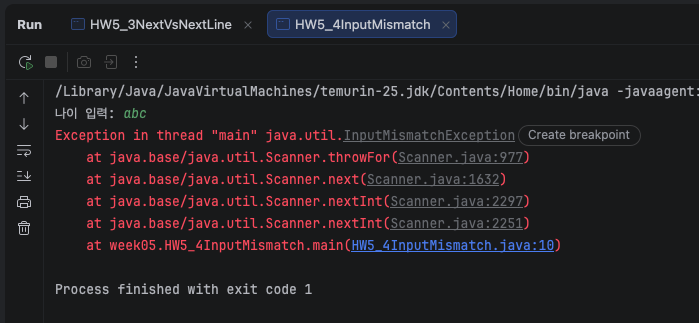
***

### 5-5. 지난 과제를 입력받게 고치기
아래 두 개를 Scanner 로 고쳐서 다시 제출하세요.   

① 3-1 초를 시·분·초로     → 초를 입력받게   
② 3-2 평균                 → 국어·영어·수학 점수를 입력받게   

**조건 1: 계산 부분은 건드리지 마세요. 값을 넣는 부분만 바꿉니다.**    
**조건 2: ② 는 평균이 소수점까지 나와야 합니다. (double) 위치 다시 확인.**      
**조건 3: 각각 두 번씩 다른 값을 넣어서 돌리고, 결과를 둘 다 적으세요.**   

※ 3주차에 "맨 윗줄 하나만 고치면 되도록" 이라고 했던 조건,  
이번엔 아예 안 고쳐도 되게 만드는 겁니다. **그게 왜 나은지 한 줄로.**  
코드를 전혀 안 건드리니 값 바꿀 때마다 수정하고 다시 컴파일할 필요 없이 실행만 다시 해서 바로 다른 값을 테스트할 수 있어서 더 나음

#### - 실행 결과
```text
① 3-1 초를 시·분·초로

    초 입력: 3725
    1시간 2분 5초
    
    초 입력: 12345
    3시간 25분 45초

② 3-2 평균

    국어: 85
    영어: 90
    수학: 78
    평균: 84.33333333333333
    
    국어: 90.5
    영어: 85
    수학: 74.7
    평균: 83.39999999999999  

```
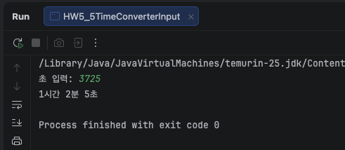            
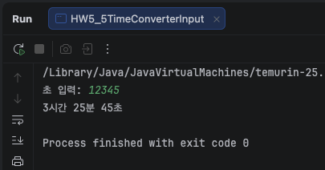      

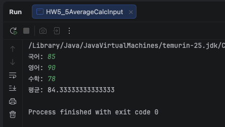      
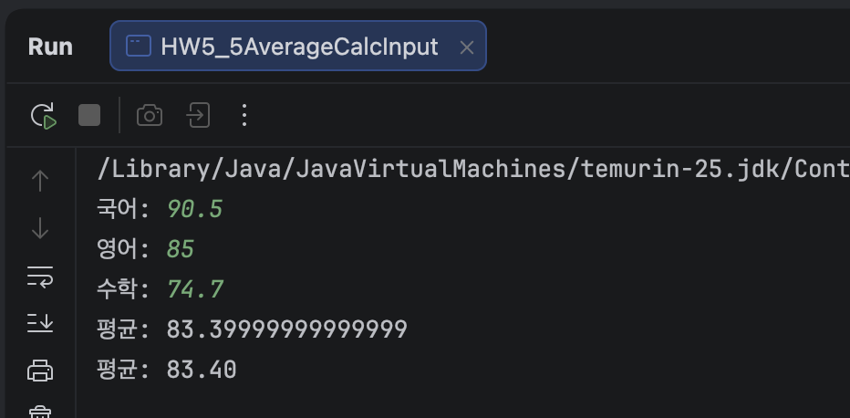   
***

### 5-6. char 는 어떻게 받나
학점(A, B, C) 을 char 로 입력받으려고 합니다.   

```java
char grade = sc.nextChar();
```
이렇게 쓰고 돌려보세요.    

**→ 오류 메시지를 그대로 적으세요**  
하단 참조

**→ Scanner 에 nextChar() 가 없습니다. 그럼 어떻게 받나요. 찾아서 고치세요**   
Scanner 클래스 안에 애초에 nextChar() 라는 메서드가 없음    
next() 로 글자를 받은 다음 첫 글자를 charAt(0)로 꺼냄

**→ 고친 코드를 적고, 왜 그렇게 되는지 한 줄로**   
next()는 공백 전까지 한 단어를 읽고 charAt(0)은 그 문자열의 첫 번째 글자를 char로 꺼냄.


힌트: next() 로 글자를 받은 다음, 그 중 첫 글자만 꺼냅니다.   
꺼내는 방법은 charAt(0) 입니다. 이건 지금 그냥 쓰세요.   
문자열 다루는 건 7주차에 제대로 합니다.   

※ 안 되는 걸 한 번 해보고 나서 고치는 겁니다.      
바로 정답부터 쓰지 마세요. 오류 메시지를 봐야 왜 charAt 을 쓰는지 남습니다.

#### - 오류 메시지
```text
    HW5_6CharInput.java: 10
    java: cannot find symbol
    symbol:   method nextChar()
    location: variable sc of type java.util.Scanner
```
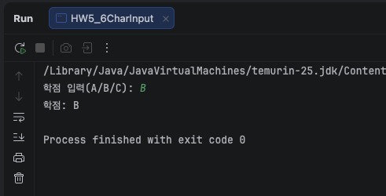   
***

## 도전 과제
### 도전 1. 윤년 다시
지난주 도전2 를 year 입력받게 고치세요.   

1900, 2000, 2024 를 넣어서 세 번 돌리고 결과를 적으세요.   
코드는 한 번도 안 고칩니다.   

**조건 1: 지난주 식 그대로 쓸 것. && || 괄호 포함**   
**조건 2: 지난주에 못 적은 거 하나 — 괄호를 빼도 결과가 같았던 이유를 한 줄로**   
&&가 || 보다 우선 순위가 높고 괄호가 없어도 똑같은 순서로 계산 하기 때문에 

지난주엔 세 번 고치고 세 번 컴파일했죠. 이번엔 한 번입니다.   
그 차이를 직접 느껴보라고 같은 문제를 또 내는 겁니다.  

#### - 실행결과
```text
연도입력: 1900
1900년 윤년 아님 X

연도입력: 2000
2000년 윤년 O

연도입력: 2024
2024년 윤년 O
```
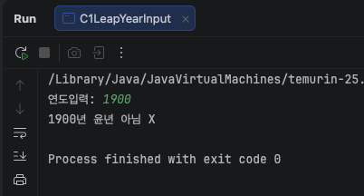   
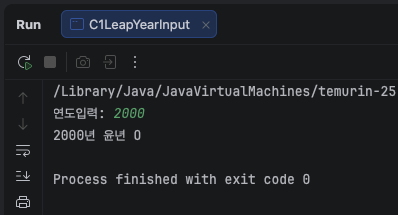  
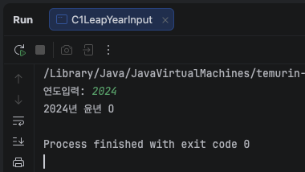   
***

### 도전 2. 계산기
숫자 두 개와 연산자 하나를 입력받아 계산하세요.

```java
첫 번째 수: 10   
연산자 (+ - * /): /      
두 번째 수: 4    
10 / 4 = 2.5    
```
***조건 1: 결과가 2 가 아니라 2.5 가 나와야 합니다. 3주차 (double) 다시.***   
***조건 2: 연산자는 char 로 받으세요. 5-6 에서 한 방법으로.***    
***조건 3: 사칙연산을 조건문 없이 해야 합니다. 삼항 연산자를 겹쳐 쓰세요.***     
```text
double result = (op == '+') ? a + b
              : (op == '-') ? a - b
              : (op == '*') ? a * b
              : a / b;
```

이 모양 그대로 써도 됩니다. 대신 왜 이렇게 되는지 한 줄 적으세요.   
***→ 삼항 연산자의 : 뒤에 다시 삼항 연산자를 이어 쓸 수 있어서 앞 조건이 거짓이면 다음 조건으로 넘어감***

***조건 4: 0 으로 나누기를 넣어보세요. 10 / 0 을 치면 어떻게 되나요.   
      3-5 에서 본 그겁니다. double 로 받았으면 뭐가 나올까요.   
      예상부터 적고 돌리세요.***

※ 조건문(if) 은 10주차입니다. 지금은 삼항으로 버팁니다.   
10주차 가면 이걸 if 로 다시 씁니다. 그때 어느 쪽이 읽기 쉬운지 비교합니다.   

#### - 결과 예상
```
(double)이 없으면 Exception in thread "main"
(double)이 있으면 10 / 0 = Infinity
```
#### - 실행 결과
```
    첫 번째 수: 10
    연산자 (+ - * /): /
    두 번째 수: 4
    10 / 4 = 2.5
    
    ======================
    
    첫 번째 수: 10
    연산자 (+ - * /): /
    두 번째 수: 0
    Exception in thread "main" java.lang.ArithmeticException: / by zero
        at week05.C2Calculator.main(C2Calculator.java:22)
    
    ======================
    
    (double)이 있으면
    첫 번째 수: 10
    연산자 (+ - * /): /
    두 번째 수: 0
    10 / 0 = Infinity

```
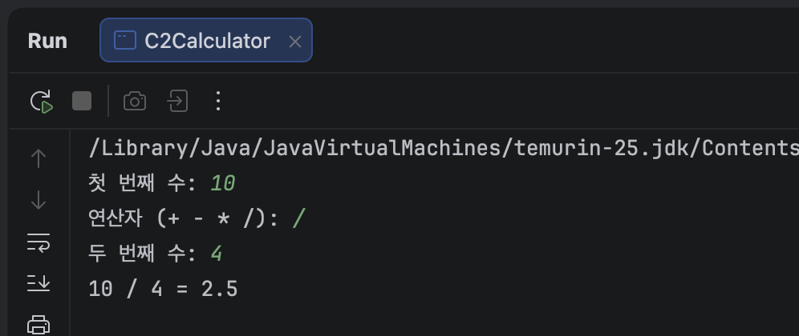   
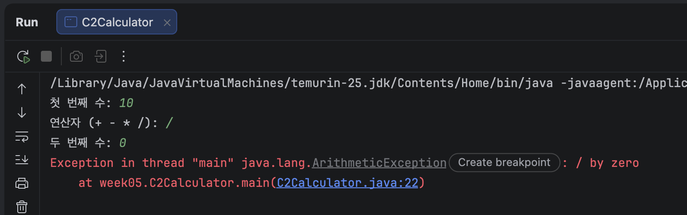   
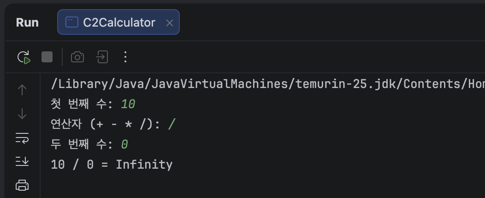 
***

### 도전 3. 거스름돈 다시
3주차 도전1 을 금액 입력받게 고치세요.   
```text
    금액을 입력하세요: 87600
    50000원 : 1장
    10000원 : 3장
    5000원  : 1장
    1000원  : 2장
    500원   : 1개
    100원   : 1개
```
***조건 1: 계산 부분은 3주차 것 그대로. 입력만 바꿉니다.***     
***조건 2: 87600 말고 다른 금액도 하나 넣어서 돌리고 결과를 적으세요.***    
***조건 3: 3주차 피드백에서 얘기한 것 — amount 를 계속 덮어쓰면 마지막에 원래 금액을 못 씁니다.   
맨 끝에 이 줄을 넣어보세요.*** 

```java
System.out.println("입력하신 " + amount + "원의 거스름돈입니다"); 
```
제대로 나오나요? 안 나오면 왜 안 나오는지 적고, 고치세요.   

제대로 안 나옴. "입력하신 100원의 거스름돈입니다" 로 찍힘(87600 넣었는데도).   
amount 를 50000, 10000, 5000, 1000, 500 으로 나눌 때마다 %= 로 계속 덮어써서, 마지막엔 100 미만으로 남은 나머지(100)만 amount 에 남아있기 때문.   
고친 방법: 입력받자마자 `int originalAmount = amount;` 로 원래 값을 따로 저장해두고, 맨 끝 출력에는 amount 대신 originalAmount 를 씀.

※ 3주차에 "원래 값을 나중에 또 쓸 것 같으면 따로 둬라" 고 했던 그겁니다.   
그때는 말로만 했는데, 이번엔 실제로 걸립니다.  

#### - 실행 결과
```
    금액을 입력하세요: 87600
    50,000 1장
    10,000 3장
    5,000 1장
    1,000 2장
    500 1개
    100 1개
    입력하신 87600원의 거스름돈입니다
    
    ======================
    
    금액을 입력하세요: 1808000
    50,000 36장
    10,000 0장
    5,000 1장
    1,000 3장
    500 0개
    100 0개
    입력하신 1808000원의 거스름돈입니다

```
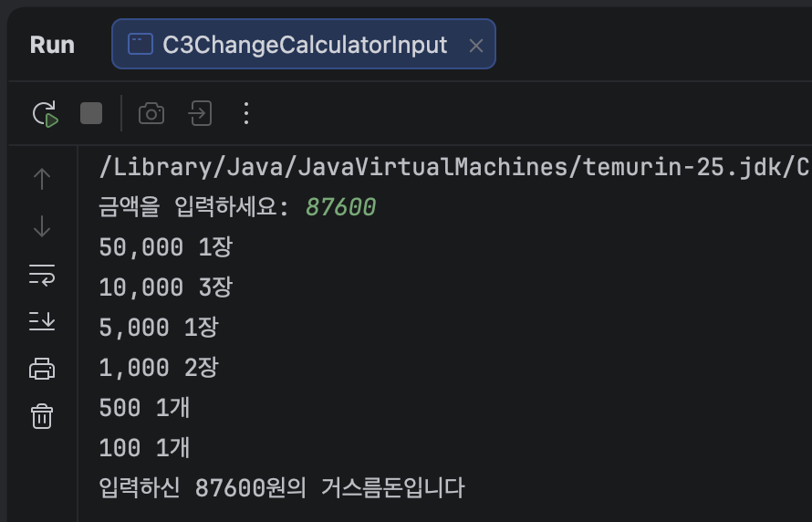   
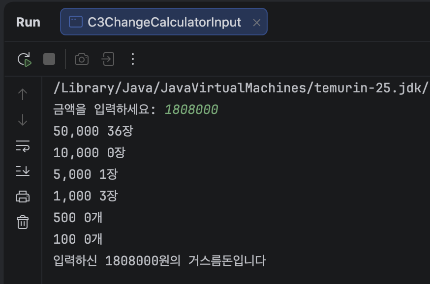
***

## 힌트

Scanner 는 세 줄입니다.   
```java
import java.util.Scanner;                       // 맨 위. class 보다 위

Scanner sc = new Scanner(System.in);            // 준비
int age = sc.nextInt();                         // 받기
sc.close();                                     // 끝나면 닫기
```
import 는 "이거 쓸 거다" 하고 미리 알려주는 겁니다.    
안 쓰면 자바가 Scanner 가 뭔지 모릅니다.   
IntelliJ 는 Alt + Enter 누르면 자동으로 넣어줍니다.   
그래도 처음 몇 번은 손으로 쳐보세요.   

받는 방법이 자료형마다 다릅니다.   
```text
sc.nextInt()        정수   
sc.nextDouble()     소수   
sc.next()           단어 하나 (공백에서 끊김)   
sc.nextLine()       한 줄 전체 (공백 포함)   
sc.nextBoolean()    true / false  
```
nextChar() 는 없습니다. 5-6 에서 확인하세요.   

이번 주 제일 중요한 한 줄입니다.
엔터는 남는다.   

nextInt() 는 숫자만 가져갑니다. 내가 누른 엔터는 그 자리에 남습니다.   
그 다음 nextLine() 이 오면, 남아 있던 그 엔터를 읽고 바로 끝납니다.   

nextInt()  →  20 을 가져감.  엔터는 남음    
nextLine() →  남은 엔터를 읽음.  빈 문자열   

해결은 간단합니다. 엔터를 하나 버리면 됩니다.    

int age = sc.nextInt();   
sc.nextLine();              // 남은 엔터 버리기   
String name = sc.nextLine();   

5-2 에서 직접 겪고 나서 이 힌트를 다시 읽으세요.   
먼저 읽고 피해 가면 남는 게 없습니다.   

입력은 컴파일러가 못 막습니다.   

int age = sc.nextInt();   

이 줄은 형식이 완벽합니다. 컴파일 잘 됩니다.   
사용자가 abc 를 치는 순간 터집니다.   

컴파일 오류 ->   코드가 틀림.  ->  내가 고칠 수 있음.   
실행 오류   ->   값이 틀림.    ->  사용자가 뭘 칠지 내가 모름.   

그래서 입력받는 프로그램부터는 "사용자가 이상한 걸 넣으면?" 을 항상 생각해야 합니다.   
막는 방법은 10주차 조건문에서 합니다.   
이번 주는 터지는 걸 구경만 하세요. 

지난주에 얘기한 것 이어서    

□ week04.java → Week04.java, class week04 → Week04   
 IntelliJ 에서 클래스 이름 위에 커서 두고 Shift + F6   
□ 4-5 컴파일 오류 vs 실행 오류 차이 한 줄 (두 번 빠졌습니다)   
 이번 주 5-4 가 같은 질문입니다. 거기서 답하면 됩니다   
□ 도전2 괄호 빼도 결과가 같았던 이유 — && 가 || 보다 먼저      
 이번 주 도전1 에서 답하면 됩니다   
□ 4-6 왜 0.30000000000000004 가 나오는지 한 줄 + 실행 결과에 그 숫자   
□ 검산할 때 ⭕ ❌ 는 뜻을 하나로 고정해서   
□ 실행 결과를 적은 다음에 한 번만 더 물어보기 — "그래서 뭐?"      
 이번 주 문제마다 "한 줄로" 를 넣어둔 게 그겁니다   

## 제출 전 확인
- [x] import java.util.Scanner; 를 넣었는가
- [x] 5-2 를 먼저 겪어보고 나서 고쳤는가 (힌트 먼저 보지 않았는가)
- [x] 5-4 오류 메시지에서 내 파일 이름이 있는 줄을 찾았는가
- [x] 5-4 에서 컴파일 오류인지 실행 오류인지 답했는가
- [x] 5-5 평균이 소수점까지 나오는가
- [x] 5-6 을 오류부터 내보고 고쳤는가
- [x] 도전1 괄호 이유를 적었는가
- [x] 도전2 를 0 으로 나눠봤는가
- [x] 도전3 에서 원래 금액이 제대로 출력되는가
- [x] 입력값을 바꿔 두 번씩 돌린 결과를 적었는가
- [x] "한 줄로" 라고 한 데 전부 한 줄이 적혔는가
***
